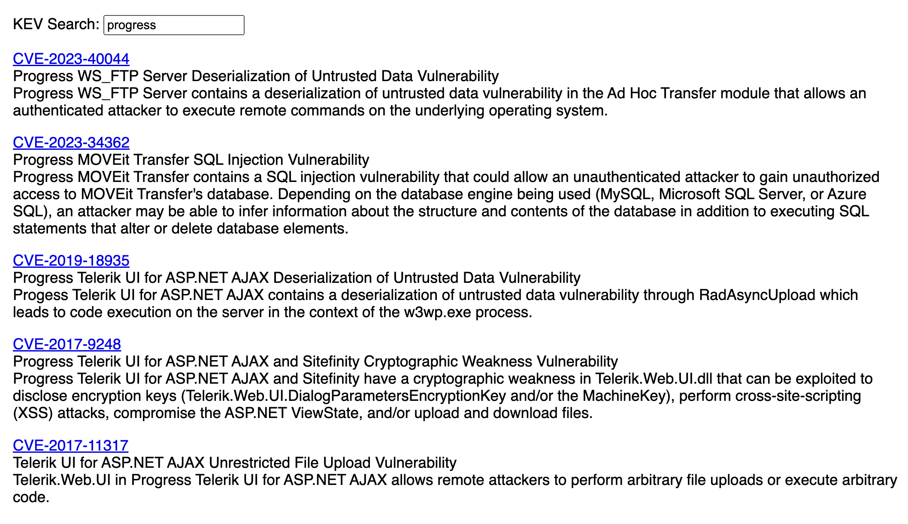
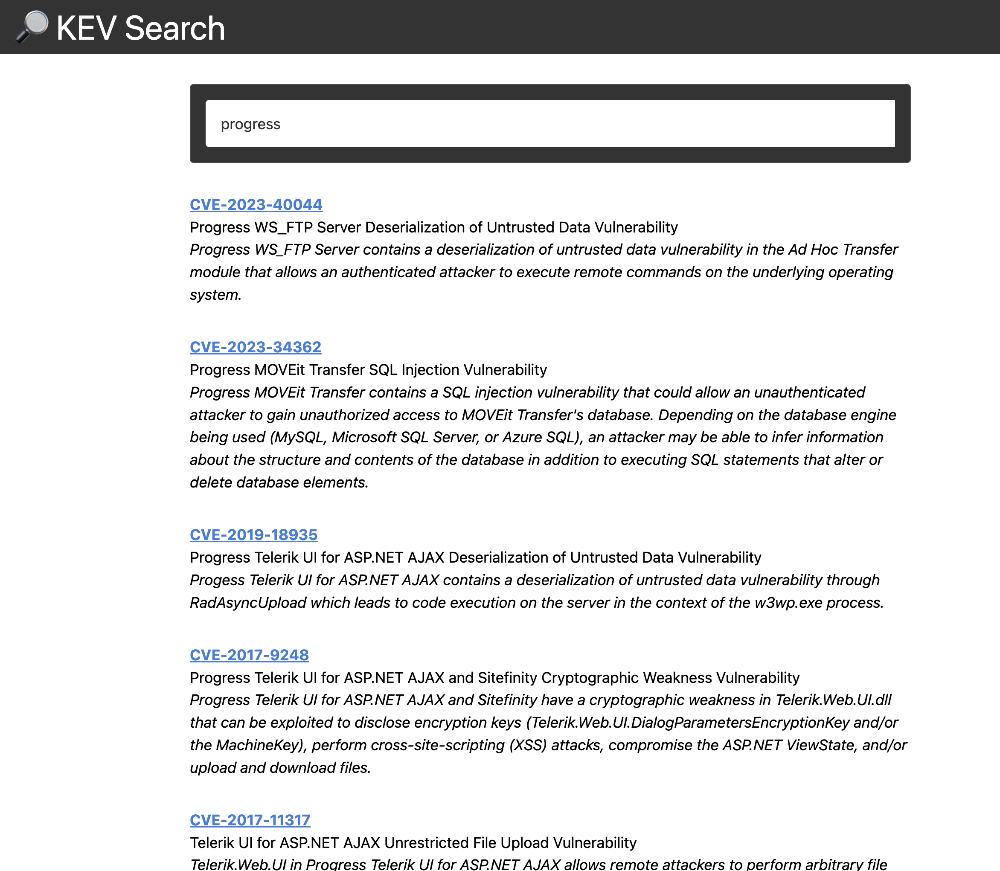

# mini-kev-search

A small example application that lets you search-as-you-type CISA's KEV catalog using MiniSearch.

You can riff from `bare-bonex.html`, which is a self-contained, single HTML file with two dependencies loaded from JSDelivr.

Or, you can:

```bash
$ npm i
$ npm run dev # to riff in dev mode
$ npm run build # to build the site into `dist/`
$ # change `base` in `vite.config.js` to reflect 
$ # what comes after `root`, below
$ scp dist/* you@some.example.com:~/some/web/root/
```

for a slightly fancier version.

Ref: <https://dailyfinds.hrbrmstr.dev/p/drop-348-2023-10-06-weekend-project>

Ref: <https://companion.hrbrmstr.dev/posts/2023-10-06-minisearch/>

Bare bones:


Fancier:
